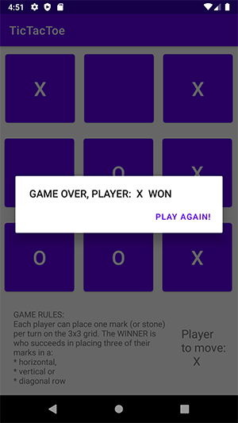

# **TIC TAC TOE ANDROID APP**
### My personal project TIC TAC TOE build in Android Studio
---
## **Project description**
This project is a simple tic tac toe game in 3x3 grid. Player X and Player 0.
First player is randomly selected.
For placing stones you need to click on stone.
Right now you need to play for both players. I am working on version where other player move will be generated automaticly.
## **Game Rules**
Each player can place one mark (or stone)
per turn on the 3x3 grid. The WINNER is
who succeeds in placing three of their
marks in a:
* horizontal,
* vertical or
* diagonal row

## **Game preview**
Start:

During game:

End of the game:
)
